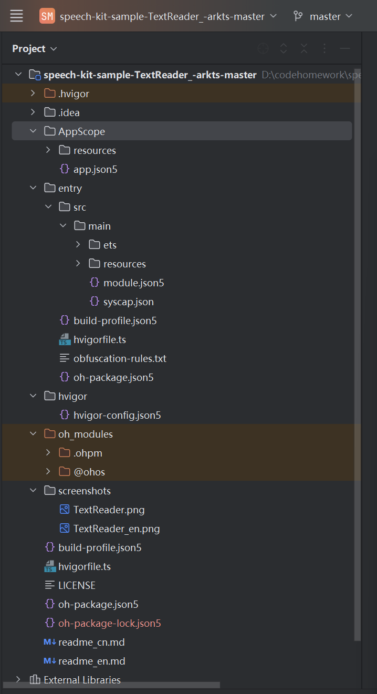

一、项目基础信息
项目名称：speech-kit-sample-TextReader 鸿蒙文本语音朗读应用
开发语言：ArkTS
开发工具：DevEco Studio
目标系统：OpenHarmony
核心功能
自定义文本输入展示
调用系统语音合成接口，实现文字转语音朗读
适配中英文国际化，随系统语言切换界面文字
工程规范：完全遵循 OpenHarmony 官方标准应用分包结构，目录分层解耦

二、完整工程目录树（1:1 匹配本地 DevEco Studio 截图）
plaintext
speech-kit-sample-TextReader_-arkts-master
├─ .hvigor                    // 构建工具运行缓存目录
├─ AppScope                   // 应用全局作用域根目录
│  ├─ resources               // 全应用共享静态资源目录
│  └─ app.json5               // 应用全局顶层配置文件
├─ entry                      // 应用唯一主业务模块
│  ├─ src
│  │  └─ main                 // 模块主源码根目录
│  │     ├─ ets               // ArkTS核心业务代码存放目录
│  │     └─ resources         // entry模块私有资源目录
│  ├─ module.json5            // entry模块核心配置文件
│  ├─ syscap.json             // 系统能力依赖声明文件
│  ├─ build-profile.json5     // entry模块级编译打包配置
│  ├─ hvigorfile.ts           // entry模块自定义构建任务脚本
│  ├─ obfuscation-rules.txt   // 代码混淆规则配置文件
│  └─ oh-package.json5        // entry模块第三方依赖管理文件
├─ hvigor                     // 工程全局构建工具根目录
│  └─ hvigor-config.json5     // hvigor构建工具全局参数配置
├─ oh_modules                 // OHPM包管理器第三方依赖库存放目录
│  ├─ .ohpm                   // OHPM工具缓存目录
│  └─ @ohos                   // 鸿蒙官方系统能力依赖包
├─ screenshots                // 项目运行截图存放文件夹
│  ├─ TextReader.png          // 中文语言界面运行截图
│  └─ TextReader_en.png       // 英文语言界面运行截图
├─ build-profile.json5        // 工程根目录全局编译打包配置
├─ hvigorfile.ts              // 工程全局自定义构建脚本
├─ LICENSE                    // 项目开源许可协议文件
├─ oh-package.json5           // 项目顶层版本与全局依赖配置
├─ oh-package-lock.json5      // 依赖锁定文件，统一所有环境依赖版本
├─ readme_cn.md               // 中文简易项目介绍文档
├─ readme_en.md               // 英文简易项目介绍文档
└─ PROJECT_DESC.md            // 本作业阶段二工程完整解析文档
三、各级目录与文件详细解析
1. 全局顶层目录文件
（1）.hvigor
hvigor 构建工具在编译、打包过程中自动生成的缓存目录，存放编译中间产物、构建日志、临时配置。
开发过程中无需手动修改，清理工程时可直接删除，下次编译自动重新生成。
（2）hvigor 文件夹
存放构建工具全局配置文件 hvigor-config.json5，用于统一配置 hvigor 编译环境、编译日志等级、构建输出路径、插件加载规则，作用于整个项目所有模块。
（3）oh_modules
OHPM（OpenHarmony Package Manager）依赖包管理目录，执行依赖安装命令后自动生成。
.ohpm：包管理器本地缓存；
@ohos：鸿蒙官方提供的系统能力 SDK，本项目依赖语音合成、UI 组件、资源管理等能力均存放于此。
项目编译时会自动读取该目录下依赖，打包时按需引入对应能力。
（4）screenshots
作业配套截图目录，存放程序真机 / 模拟器运行效果图：
TextReader.png：系统语言为中文时的应用界面；
TextReader_en.png：系统语言为英文时的应用界面；
直观展示项目国际化、文本朗读页面效果，用于作业成果展示。
（5）工程根目录配置文件
build-profile.json5
全局工程级编译配置，统一管理全项目设备适配类型、编译产物输出目录、签名打包参数、多模块编译顺序。entry 模块内存在同文件，用于单独配置模块专属编译规则。
hvigorfile.ts
全局构建脚本，可自定义全局编译、打包、校验、清理等拓展任务，支持引入第三方构建插件，统一所有模块的构建流程。
LICENSE
开源协议声明文件，规定本项目代码开源使用、修改、分发权限，是 OpenHarmony 官方示例工程标配文件。
oh-package.json5
项目顶层依赖描述文件，记录项目名称、版本号、全局公共依赖、最低系统版本要求。
oh-package-lock.json5
依赖锁定文件，精确记录每一个依赖包的安装版本，保证不同设备、不同开发者拉取代码后，安装完全一致的依赖，避免版本冲突。
readme_cn.md / readme_en.md
极简版项目说明文档，分别使用中英文介绍项目用途、运行方式、基础功能，供快速预览项目。
PROJECT_DESC.md
本文件，作业阶段二要求编写的完整工程结构解析文档，详细说明每一个目录、文件的作用与项目整体功能。
2. AppScope 应用全局作用域目录
AppScope 是整个应用的顶层全局作用域，资源与配置对全部业务模块生效。
resources
全局共享资源文件夹，存放全应用通用媒体资源，例如应用桌面图标、全局公共图片、全局样式常量。所有 entry 等业务模块均可直接引用此处资源。
app.json5
应用全局核心配置文件，作用范围覆盖整个 App：
定义应用唯一包名、应用展示名称；
声明全应用通用系统权限；
配置应用入口模块、默认启动页面；
配置应用图标、窗口基础属性。
3. entry 主业务模块（项目核心代码存放处）
entry 是本项目唯一业务模块，所有页面、交互逻辑、业务代码均在此目录。
（1）entry/src/main 源码根目录
ets 文件夹
ArkTS 代码根目录，存放应用程序生命周期入口、所有 UI 页面、业务逻辑代码：
EntryAbility 程序入口：控制应用启动、切前台 / 后台、销毁全生命周期回调，做初始化操作；
pages 页面目录：存放首页 Index.ets，实现文本输入框、朗读按钮、文字转语音播放、中英文切换交互逻辑。
resources 文件夹
仅对 entry 模块生效的私有资源目录：
media：页面内使用的图片、图标、背景素材；
element：颜色、字体大小、圆角、间距等 UI 样式常量；
多语言目录：存放中英文独立文本，实现界面文字随系统语言自动切换。
（2）entry 模块独立配置文件
module.json5
模块专属核心配置，仅作用于 entry 模块：
注册模块内所有页面、Ability 组件；
声明当前模块需要申请的系统权限；
配置页面路由、页面启动模式、页面窗口参数。
syscap.json
系统能力声明文件，明确标注本项目运行依赖的 OpenHarmony 系统能力，本项目包含图形 UI 能力、语音合成播报能力、资源管理能力。系统会根据该文件分配对应底层接口权限。
build-profile.json5
entry 模块独立编译配置，单独设置本模块编译参数、打包输出、依赖编译规则，与根目录同名文件互不干扰。
hvigorfile.ts
模块级构建脚本，可单独为 entry 新增编译、代码校验、资源压缩等自定义任务，仅对当前模块生效。
obfuscation-rules.txt
代码混淆规则配置，应用发布打包时，根据文件内规则对 ArkTS 业务代码进行名称混淆，保护核心业务逻辑不被逆向解析。
oh-package.json5
entry 模块独立依赖配置，记录模块专属第三方依赖，区分全局依赖与模块私有依赖。
四、项目完整功能概述
本项目是基于 OpenHarmony ArkTS 开发的简易文本朗读工具，完整实现以下功能：
自定义文本输入展示：页面提供多行文本输入组件，支持用户自由输入任意中文、英文文本，实时展示内容；
文字转语音朗读：调用系统语音合成官方接口，读取输入框内文字，自动播放人声朗读，支持基础播放启停控制；
中英文国际化适配：工程内置两套语言资源，切换设备系统语言后，页面标题、按钮文字自动切换对应语种；
标准化分层工程结构：严格遵循 OpenHarmony 开发规范，全局资源、模块私有资源、业务代码、编译配置完全分层隔离，结构清晰易维护、拓展。